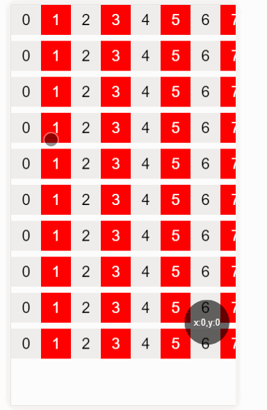

# v-scroller
> A mobile Vue plugin for scroller

> pluginName:  v-scroller

> version: 1.2.2

> author:	Alan Chen

> github:	alanchenchen@github.com

> date:	2017/11/15

#### This plugin is just only adapted for mobile.

## Why making this plugin
* There are so many vue plugins on github,but i haven't found a suitable mini vue plugin for scroller.The best scroller plugin i have seen is the 'better-scroller',however it's not for vue especially.I decide to make a mini vue scroller plugin for my own company programs also for people who wanna use scroller simply.

## What you can do with the plugin
* You can use it to make a scroller container includes pulling-refresh,infinite-loading and horizonal scroller also supporting nesting different direction scroller.

 

[中文文档](./ChineaseREADME.md)
## How to use
* NPM install the v-scroller plugin
```node
npm install v-scroller --save
```
#### 1.vue spa
* import the plugin and use  
``` javascript 
import scroller from 'v-scroller'
Vue.use(scroller)
```
#### 2.script html
* directly write the script,in deed you have to `insert the vue.js` script firstly  
``` html 
<script src="dist/v-scroller.js"></script>
```
* use the component scroller directly in your vue spa file or the Vue instance
``` javascript 
<scroller />
```

## Options
#### props

| prop name  |      description                         |required| default |
|:-----------:|:----------------------------------------:|:------:|:-------:|
| snapping    | `[Boolean]`enable snapping mode          |   no   |  false  |
| smooth      | `[Boolean]`enable smooth scrolling       |   no   |  true   |
| isDownFresh | `[Boolean]`enable pull down to refresh   |   no   |  false  |
| isUpLoad    | `[Boolean]`enable infinite loading       |   no   |  false  |
|horizonalMode| `[Boolean]`enable horizonal scroller mode|   no   |  false  |

> Notice:while switching horizonalMode,only upLoad is abled to work,it shows that scroll-right infinite loading also the emit event name is the same to `upLoad`.

#### emit events
* `downFresh `   when you pull down your container at the top border,write your logic in it usually write the ajax.Make sure the `isDownFresh` prop is `true`. 
* `upLoad `   when you scroll your container at the bottom border,write your logic in it usually write the ajax.Make sure the `isUpLoad` prop is `true`. 
* `beforeScroll `  before you scroll just mean you touch the container. 
* `scroll `  when you're scrolling the container.
* `afterScroll `  after you scroll just mean you raise your finger from the container.

#### plugin methods
> Notice:You have to add `ref` to the component `scroller` and then use this.$refs to get following methods.

* `closeLoad (Function) `  no param,forbid infinite loading animation,usually use when your ajax finished.
* `refreshLoad(Function) ` no param,refresh infinite loading .
* `getPosition (Function)`  no param,get current position of scroller content. 
* `scrollTo (Function(Number,Boolean)) `   scroll to a position in scroller content,two params,the first param required `Number`,the second param isn't required ,it means whether open or close the scrolling animation.

#### slots

| slot name    |      description                         | default     | suggest                 |
|:------------:|:----------------------------------------:|:-----------:|:-----------------------:|
| `downrefresh`| animation during pull-down refresh       |   svg       |  add className spinner  |
| `upload`     | animation during infinite loading        |   svg       |  add className spinner  |
| `nomore`     | text while foridden infinite loading     |没有更多内容了|  add className nomore   |
